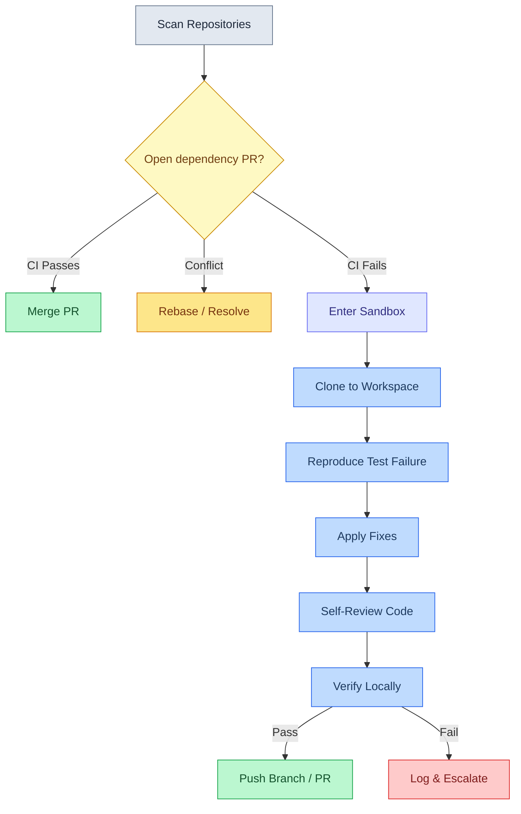

# dependency-director

[](pyproject.toml)
[](LICENSE)
[](pyproject.toml)


> [!NOTE]
> `dependency-director` is a proof of concept. It automatically
> executes code edits, runs local tests, pushes branches, and merges
> pull requests. Always start with `--dry-run`, use a scoped GitHub
> token, and monitor runs closely.

An experimental autonomous dependency triage and patching agent built
on the [**Google Antigravity SDK**](https://antigravity.google) and
powered by Gemini models. It uses local GitHub API host tools to
monitor, validate, and resolve automated dependency update pull
requests (such as those from automated dependency update tools like
Renovate and Dependabot) across your repositories.

---

## Quick Start

Get up and running in a few commands:

1. **Clone the repository:**

   ```bash
   git clone https://github.com/kweinmeister/dependency-director.git && cd dependency-director
   ```

1. **Install dependencies:**

   ```bash
   uv sync
   ```

1. **Configure environment variables (optional):**

   ```bash
   export GEMINI_API_KEY="your_key"
   # Optional but highly recommended to enable merges & avoid rate limits
   export GITHUB_TOKEN="your_token"
   ```

1. **Run a dry-run simulation:**

   ```bash
   uv run depdirector your-org/your-repo --dry-run
   ```

---

## How It Works

`DependencyDirector` acts as an automated triage partner for project
maintainers. It handles the repetitive process of managing dependency
updates by separating successful upgrades from those requiring
adjustments:

1. **Auto-Merging Green Upgrades:** When a dependency update PR
   passes all CI checks and has no merge conflicts, the agent
   squash-and-merges the PR immediately.
2. **Conflict Resolution:** For PRs with merge conflicts, the agent
   requests a rebase from the update tool or manually resolves the
   conflict depending on whether the branch has been previously
   edited.
3. **Local Diagnosis and Patching:** If an upgrade causes CI to fail
   (e.g., due to breaking API changes in the dependency), the agent
   clones the repository into an isolated workspace, reproduces the
   test failure, edits source code to fix the integration, runs a
   self-review, and pushes the patch.



### Broken base branches

A dependency PR fails CI for one of two reasons: the bump broke
something, or the base branch was already red before the bump
landed. These need opposite responses, so before cloning for a RED
PR the agent calls `get_branch_ci_status` once per run to tell them
apart.

A red base does not excuse every red PR, so the comparison is per
check name: the base only takes the blame for checks it is failing
too. A PR that fails a check the base passes introduced that failure
itself and is fixed as normal — otherwise one unrelated broken job
(a deploy step, say) would quietly stop every fix in the repository.

When the base is failing the same checks, no dependency PR in that
repository can go green on its own. By default the agent reports the
cause once and skips the remaining RED PRs rather than attempting
fixes that cannot succeed — a repo-wide fix does not belong in a
`dependabot/*` branch, where it would be poor review hygiene and
would make Dependabot stop managing the PR.

Passing `--fix-base` lets the agent repair the base instead. The fix
goes into its own PR against the base branch, scoped to only what
the failing checks complain about, and is never merged
automatically — not even under `--auto-merge`, since merging the
agent's own change to a default branch is a larger step than merging
a dependency bump. The dependency PRs stay blocked until that PR is
reviewed, merged, and the bots rebase.

---

## Safety Guardrails

The agent operates under two modes of programmatic safety:

1. **OS-Level Sandboxing** — By default, command execution is
   sandboxed using
   [sandbox-runtime](https://github.com/anthropic-experimental/sandbox-runtime)
   on macOS and Linux. This enforces:
   - **Filesystem isolation** — Read access to the home directory
     is denied (toolchain caches like `.pyenv`, `.npm`, `.cargo`
     are still allowed), and writes are restricted to `/tmp` and
     the active workspace. Sensitive files like `.env`,
     `.git/hooks`, and `.git/config` are always protected.
   - **Network restriction** — All inbound and outbound traffic
     is blocked except for an allowlist of VCS hosts and package
     registries (see
     [Network allowlist](#network-allowlist) below). Known
     exfiltration endpoints are explicitly denied.
   - **Argv-mode invocation** — Commands are parsed via
     `shlex.split` and passed to srt as an argv array (`srt
     -- *argv`). srt's POSIX quoter ensures each argument is
     faithfully quoted for the underlying shell, neutralizing
     shell metacharacters (redirections, substitutions,
     backticks) in argument values.
   - **macOS + Go caveat** — Go's TLS stack queries
     `com.apple.trustd.agent`, which the sandbox blocks. Go
     dependency upgrades may fail with TLS errors unless you add
     `"enableWeakerNetworkIsolation": true` to your sandbox
     settings file (e.g. `~/.srt-settings.json` or a custom
     settings JSON) — see the
     [sandbox-runtime docs](https://github.com/anthropic-experimental/sandbox-runtime)
     for trade-offs.

1. **Application-Level Defense-in-Depth** — Before reaching srt,
   commands are validated against an executable denylist:
   - **Shell interpreters blocked** — `bash`, `sh`, `dash`,
     `zsh`, `ksh` are rejected (the agent has no legitimate use
     for shell wrappers).
   - **Exec pivots blocked** — `find -exec`, `xargs`, and
     `env -S/--split-string` are rejected.
   - **Dangerous executables blocked** — `curl`, `wget`, `sudo`,
     `nc`/`netcat`, and system control commands are rejected.
   - **Shell operators rejected** — `;`, `|`, `&` as standalone
     argv elements are rejected. `&&` and `||` are supported and
     handled at the application level with proper short-circuit
     semantics — each sub-command is validated and sandboxed
     independently.
   - **Git hardening** — Dangerous config keys (`credential.helper`,
     `core.hookspath`, `core.sshcommand`), flags (`--upload-pack`,
     `--receive-pack`, `--config-env`, `--git-dir`), and protocol
     extensions are blocked.
   - **GitHub token scoped** — The token env vars are only present
     in the subprocess environment when running git commands.

1. **File tools bounded to the workspace** — srt sandboxes command
   execution, but the SDK's built-in `view_file`, `edit_file` and
   `create_file` tools do not go through it. A `workspace_only`
   policy confines all three to the per-repo clone and the agent
   skill directory, so they cannot reach the rest of the host —
   including this project's own checkout and `.env`.

1. **No-Sandbox Fallback (`--no-sandbox`)** — When sandboxing is
   explicitly bypassed, the agent falls back to GitHub-only
   operations. No command execution tool is registered.

Additionally, PR merges are gated to configured dependency update
tools only (default configurations support automated dependency
update tools like Renovate and Dependabot), `--dry-run` mode blocks
all pushes and merges, and the agent runs a self-review before
committing any fix.

See
[`src/dependency_director/config.py`](src/dependency_director/config.py)
and
[`src/dependency_director/tools.py`](src/dependency_director/tools.py)
for the full policy and validation implementation.

### Network allowlist

Verifying a dependency bump means installing it, so the sandbox has
to reach the registry the bumped package lives in. Anything not on
this list is blocked outbound. The list lives in
[`srt-settings.json`](src/dependency_director/srt-settings.json);
point `DEPDIRECTOR_SRT_SETTINGS` at your own copy to change it.

<!-- markdownlint-disable MD013 MD060 -->

| Purpose            | Hosts                                                                                                                                       |
| ------------------ | ------------------------------------------------------------------------------------------------------------------------------------------- |
| Git hosting        | `github.com`, `api.github.com`, `codeload.github.com`, `raw.githubusercontent.com`, `objects.githubusercontent.com`, `release-assets.githubusercontent.com`, `gitlab.com`, `api.gitlab.com`, `bitbucket.org`, `api.bitbucket.org`, `ssh.dev.azure.com` |
| Python             | `pypi.org`, `files.pythonhosted.org`                                                                                                        |
| JavaScript         | `registry.npmjs.org`, `registry.yarnpkg.com`                                                                                                |
| Rust               | `*.crates.io` (covers the `index.crates.io` sparse index and `static.crates.io` downloads), `crates.io`                                     |
| Go                 | `proxy.golang.org`                                                                                                                          |
| Container images   | `*.docker.io`, `production.cloudflare.docker.com`, `ghcr.io`, `pkg-containers.githubusercontent.com`, `quay.io`, `mcr.microsoft.com`, `public.ecr.aws`, `*.pkg.dev` |

<!-- markdownlint-enable MD013 MD060 -->

Two entries are worth calling out:

- **`*.crates.io`** — Cargo's sparse protocol (the default since
  Rust 1.70) resolves the index at `index.crates.io`, which is a
  different host from `crates.io`. Without it, any repository with
  a compiled Rust extension fails at dependency resolution before a
  single crate is fetched.
- **Container registries** — Dependabot's `docker` ecosystem bumps
  base-image tags, and the only way to verify such a PR is to pull
  the new image. Each registry serves manifests and layer blobs from
  different hosts (Docker Hub authenticates at `auth.docker.io` and
  serves blobs from `production.cloudflare.docker.com`; GHCR serves
  blobs from `pkg-containers.githubusercontent.com`), so both are
  needed for a pull to complete. If you do not review Docker PRs,
  removing these tightens the sandbox at no cost.

### Package cache

Every sandboxed command runs with its package caches (`UV_CACHE_DIR`,
`CARGO_HOME`, `NPM_CONFIG_CACHE`, `GOMODCACHE`, and ~20 others) pointed
at a single shared directory, granted read and write inside the
sandbox. It deliberately lives outside the per-repo workspace, which is
deleted before and after every repository — a cache inside the
workspace would make every repo re-download every dependency.

The trade-off is that repositories in a run share a cache. That is what
makes it useful, and it is the same trust boundary as a developer
machine, but it does mean a package installed while reviewing one repo
is visible to the next. Point `DEPDIRECTOR_CACHE_DIR` at a fresh
directory per run if you would rather not share.

> [!TIP]
> **DependencyDirector works best on repositories with good test
> coverage.** When a dependency update breaks something, the agent
> relies on your test suite to detect the failure and verify its
> fix. Repositories without tests will see green PRs merged (CI
> passes vacuously) but broken updates won't be caught or patched.
> Adding tests that exercise your dependency surface area — imports,
> API calls, type checks — gives the agent the signal it needs to
> fix what's actually broken.

---

## Configuration

The agent is configured via environment variables or a local `.env`
file. A template is provided in [`.env.template`](.env.template).

<!-- markdownlint-disable MD013 MD060 -->

| Environment Variable            | Description                                                                                | Default                                                                   |
| :------------------------------ | :----------------------------------------------------------------------------------------- | :------------------------------------------------------------------------ |
| `GEMINI_API_KEY`                | API Key for accessing Gemini Developer API models (not needed if using Vertex).             | _(Required)_                                                              |
| `GITHUB_TOKEN`                  | GitHub Personal Access Token. Required to perform merges, comments, or scan private repos.  | _(Recommended)_                                                           |
| `GOOGLE_CLOUD_LOCATION`         | Google Cloud region/location (required if using Vertex AI).                                 | _(Optional)_                                                              |
| `GOOGLE_CLOUD_PROJECT`          | Google Cloud project ID (required if using Vertex AI).                                      | _(Optional)_                                                              |
| `GOOGLE_GENAI_USE_VERTEXAI`     | Set to `true` to use Google Cloud Vertex AI instead of Gemini Developer API.                | `false`                                                                   |
| `DEPDIRECTOR_BOTS`              | JSON array of bot configs (`[{"author":"...","rebase_command":"..."}]`).                    | Default bots (automated dependency update tools like Renovate/Dependabot) |
| `DEPDIRECTOR_CACHE_DIR`         | Package cache shared by every repository and run (see [Package cache](#package-cache)).     | `<tmp>/dependency-director-cache`                                         |
| `DEPDIRECTOR_COMMAND_TIMEOUT`   | Seconds allowed per sandboxed command before it is killed (minimum 10).                     | `300`                                                                     |
| `DEPDIRECTOR_CONCURRENCY`       | Maximum concurrent repository operations (1 = sequential).                                  | `1`                                                                       |
| `DEPDIRECTOR_MAX_FAILED_JOBS`   | Failed CI jobs whose logs are fetched per red PR; the rest are counted and reported.        | `3`                                                                       |
| `DEPDIRECTOR_MAX_FIX_ATTEMPTS`  | Maximum iterative fix-and-test attempts per failing PR.                                     | `3`                                                                       |
| `DEPDIRECTOR_MAX_OUTPUT_CHARS`  | Characters kept per stream from each command's output (0 = unlimited).                      | `24000`                                                                   |
| `DEPDIRECTOR_MAX_OUTPUT_LINES`  | Lines kept per stream from each command's output; the middle is dropped (0 = unlimited).    | `200`                                                                     |
| `DEPDIRECTOR_MODEL`             | Gemini model identifier to use (e.g. `gemini-3.7-flash`).                                  | `gemini-3.7-flash`                                                        |
| `DEPDIRECTOR_NO_SANDBOX`        | Set to `true` to disable sandbox-runtime (srt) sandboxing.                                  | `false`                                                                   |
| `DEPDIRECTOR_OWNER`             | Default GitHub user or organization to scan (can be overridden by CLI argument).            | _(Optional)_                                                              |
| `DEPDIRECTOR_REVIEW_WAIT`       | Minutes to poll for review bot comments after pushing a fix (0 = disabled).                 | `0`                                                                       |
| `DEPDIRECTOR_SRT_SETTINGS`      | Custom settings JSON path for sandbox-runtime (srt).                                        | Bundled `srt-settings.json`                                               |
| `DEPDIRECTOR_WORKFLOW_LOG_TAIL_LINES` | Lines kept from the end of each failed job's log.                                     | `50`                                                                      |

<!-- markdownlint-enable MD013 MD060 -->

---

## Getting Started

### Prerequisites

- Python **3.13+**
- [uv](https://github.com/astral-sh/uv) package manager
- A GitHub
  [Personal Access Token](https://docs.github.com/en/authentication/keeping-your-account-and-data-secure/creating-a-personal-access-token)
  with `repo` scope

### Installation

1. Clone the repository:

   ```bash
   git clone https://github.com/kweinmeister/dependency-director.git
   cd dependency-director
   ```

1. Install dependencies using `uv` and activate the virtual
   environment:

   ```bash
   uv sync
   . .venv/bin/activate
   ```

1. Configure your environment (optional):

   You can export variables directly in your shell, or copy the
   template to a local `.env` file:

   ```bash
   cp .env.template .env
   ```

   Provide the required keys:

<!-- markdownlint-disable MD013 MD060 -->

   | Key              | How to get it                                                                     |
   | :--------------- | :-------------------------------------------------------------------------------- |
   | `GEMINI_API_KEY` | Get an API key from [Google AI Studio](https://aistudio.google.com/app/api-keys). |
   | `GITHUB_TOKEN`   | Copy your GitHub CLI token: `gh auth token`                                       |

<!-- markdownlint-enable MD013 MD060 -->

---

## Usage

### Command Syntax

If you have activated the virtual environment or installed the
package, you can run the command directly:

```bash
depdirector [TARGET] [OPTIONS]
```

You can also run it using `uv run` without activating the virtual
environment:

```bash
uv run depdirector [TARGET] [OPTIONS]
```

Alternatively, you can execute the entry script directly:

```bash
python main.py [TARGET] [OPTIONS]
```

`TARGET` can be a GitHub user/organization (e.g., `kweinmeister`)
or a specific repository (e.g.,
`kweinmeister/dependency-director`). If omitted, the
`DEPDIRECTOR_OWNER` environment variable is used.

To view all available options, run:

```bash
depdirector --help
```

### Options

<!-- markdownlint-disable MD013 MD060 -->

| Flag                 | Description                                                                                                  |
| :------------------- | :----------------------------------------------------------------------------------------------------------- |
| `-d, --dry-run`      | Simulate execution without merging or pushing fixes.                                                         |
| `-a, --auto-merge`   | Squash-merge fix PRs via the GitHub API once CI is green, instead of leaving them for manual review.         |
| `-v, --verify-all`   | Force local test verification of all PRs (including green ones) before merging.                               |
| `--standalone-fix`   | Create fixes on a new branch with a separate PR instead of pushing to the original dependency update branch.  |
| `--fix-base`         | When the base branch is already failing CI, repair it in a separate PR against the base (see [Broken base branches](#broken-base-branches)). |
| `-c, --concurrency`  | Override the maximum concurrent repository scans.                                                            |
| `-m, --max-attempts` | Override the maximum fix-and-test attempts per failing PR.                                                    |
| `-w, --review-wait`  | Minutes to wait for review comments after pushing a fix (overrides env).                                     |
| `-H, --hint`         | Extra context appended to the agent prompt (e.g. skip a PR or supply target guidance).                       |
| `--no-sandbox`       | Disable sandbox-runtime (srt) sandboxing (restricts to GitHub-only API operations, no shell access).         |

<!-- markdownlint-enable MD013 MD060 -->

### Examples

**Dry-run simulation on a single repository:**

```bash
depdirector your-org/your-repo --dry-run
```

**Run with automatic patching and auto-merge enabled:**

```bash
depdirector your-org/your-repo --auto-merge
```

**Verify and test all green PRs locally before merging:**

```bash
depdirector your-org --verify-all
```

**Scan all repos for an owner with concurrent processing:**

```bash
depdirector your-org --concurrency 4
```

**Unblock dependency PRs stuck behind a red base branch:**

```bash
depdirector your-org/your-repo --fix-base
```

---

## Development & Testing

### Running Tests

A full suite of unit tests covers CLI parameters, concurrency,
configuration, agent prompt generation, and tool safety policies:

```bash
uv run pytest
```

### Live harness

Some behaviour is decided by the model rather than by code — whether a
red base branch excuses a red PR, for instance. Unit tests can only
assert that the instructions say the right thing, not that the agent
acts on it.

The live harness closes that gap. It runs the real model, the real
sandbox, and a real git repository built on disk, and substitutes only
GitHub itself: a fake client serves scripted check results, so a
scenario can put a base branch and a PR in any combination of red and
green. The agent clones, edits, commits, and pushes for real, and
assertions read back what landed on the remote.

These tests are slow, consume tokens, and are not deterministic, so
they are excluded from the default run and skipped without model
credentials:

```bash
uv run pytest -m live
```

### Static Analysis & Linting

Type checking is performed using `ty`:

```bash
uv run ty check src
```

Linting and formatting checks are performed using `ruff`:

```bash
uv run ruff check src
```

---

This is not an officially supported Google product. This project is
not eligible for the
[Google Open Source Software Vulnerability Rewards Program](https://bughunters.google.com/open-source-security).
