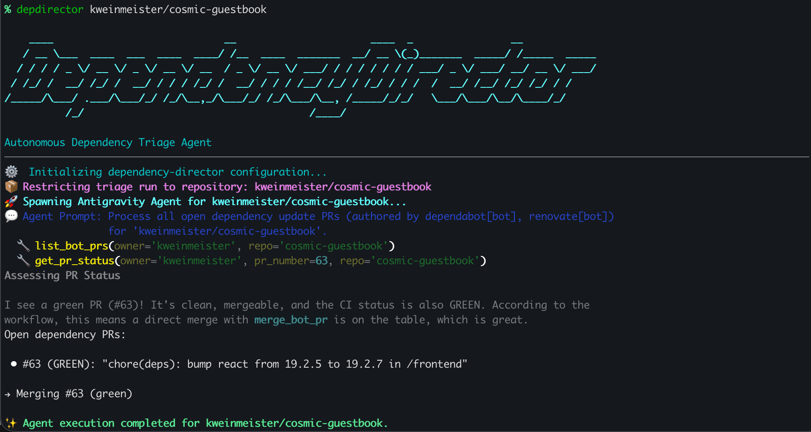
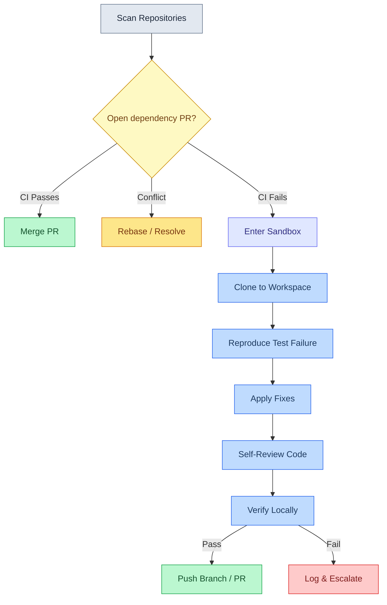

# dependency-director

[](pyproject.toml)
[](LICENSE)
[](pyproject.toml)



> [!NOTE]
> `dependency-director` is a proof of concept. It automatically executes code edits, runs local tests, pushes branches, and merges pull requests. Always start with `--dry-run`, use a scoped GitHub token, and monitor runs closely.

An experimental autonomous dependency triage and patching agent built on the [**Google Antigravity SDK**](https://antigravity.google) and powered by Gemini models. It uses local GitHub API host tools to monitor, validate, and resolve automated dependency update pull requests (such as those from automated dependency update tools like Renovate and Dependabot) across your repositories.

---

## Quick Start

Get up and running in a few commands:

1. **Clone the repository:**

   ```bash
   git clone https://github.com/kweinmeister/dependency-director.git && cd dependency-director
   ```

1. **Install dependencies:**

   ```bash
   uv sync
   ```

1. **Configure environment variables (optional):**

   ```bash
   export GEMINI_API_KEY="your_key"
   export GITHUB_TOKEN="your_token"  # Optional but highly recommended to enable merges & avoid rate limits
   ```

1. **Run a dry-run simulation:**

   ```bash
   uv run depdirector your-org/your-repo --dry-run
   ```

---

## How It Works

`DependencyDirector` acts as an automated triage partner for project maintainers. It handles the repetitive process of managing dependency updates by separating successful upgrades from those requiring adjustments:

1. **Auto-Merging Green Upgrades:** When a dependency update PR passes all CI checks and has no merge conflicts, the agent squash-and-merges the PR immediately.
2. **Conflict Resolution:** For PRs with merge conflicts, the agent requests a rebase from the update tool or manually resolves the conflict depending on whether the branch has been previously edited.
3. **Local Diagnosis and Patching:** If an upgrade causes CI to fail (e.g., due to breaking API changes in the dependency), the agent clones the repository into an isolated workspace, reproduces the test failure, edits source code to fix the integration, runs a self-review, and pushes the patch.



---

## Safety Guardrails

The agent operates under two modes of programmatic safety:

1. **OS-Level Sandboxing** — By default, command execution is sandboxed using [sandbox-runtime](https://github.com/anthropic-experimental/sandbox-runtime) on macOS and Linux. This enforces:
   - **Filesystem isolation** — Read access to the home directory is denied (toolchain caches like `.pyenv`, `.npm`, `.cargo` are still allowed), and writes are restricted to `/tmp` and the active workspace. Sensitive files like `.env`, `.git/hooks`, and `.git/config` are always protected.
   - **Network restriction** — All inbound and outbound traffic is blocked except for allowlisted VCS hosts (`github.com`, `api.github.com`, `raw.githubusercontent.com`, `codeload.github.com`, `objects.githubusercontent.com`, `gitlab.com`, `bitbucket.org`). Known exfiltration endpoints are explicitly denied.
   - **macOS + Go caveat** — Go's TLS stack queries `com.apple.trustd.agent`, which the sandbox blocks. Go dependency upgrades may fail with TLS errors unless you add `"enableWeakerNetworkIsolation": true` to your sandbox settings file (e.g. `~/.srt-settings.json` or a custom settings JSON) — see the [sandbox-runtime docs](https://github.com/anthropic-experimental/sandbox-runtime) for trade-offs.

1. **Application-Level Fallback (`--no-sandbox`)** — When sandboxing is explicitly bypassed, the agent falls back to strict application-level validation. This is a **degraded safety mode**:
   - **Restricted workflows** — The agent is limited to GitHub-only operations (merge green PRs, post rebase comments). It will not clone repositories, install dependencies, or run tests.
   - **Command allowlist** — Only read-only diagnostic commands (`echo`, `cat`, `ls`, `grep`, `git status`, `git log`, `git diff`, etc.) are permitted. All other executables, shell operators, redirections, and command substitution are denied.

Additionally, PR merges are gated to configured dependency update tools only (default configurations support automated dependency update tools like Renovate and Dependabot), `--dry-run` mode blocks all pushes and merges, and the agent runs a self-review before committing any fix.

See [`src/dependency_director/config.py`](src/dependency_director/config.py) and [`src/dependency_director/tools.py`](src/dependency_director/tools.py) for the full policy and validation implementation.

> [!TIP]
> **DependencyDirector works best on repositories with good test coverage.** When a dependency update breaks something, the agent relies on your test suite to detect the failure and verify its fix. Repositories without tests will see green PRs merged (CI passes vacuously) but broken updates won't be caught or patched. Adding tests that exercise your dependency surface area — imports, API calls, type checks — gives the agent the signal it needs to fix what's actually broken.

---

## Configuration

The agent is configured via environment variables or a local `.env` file. A template is provided in [`.env.template`](.env.template).

| Environment Variable            | Description                                                                                | Default               |
| :------------------------------ | :----------------------------------------------------------------------------------------- | :-------------------- |
| `GEMINI_API_KEY`                | API Key for accessing Gemini Developer API models (not needed if using Vertex).            | _(Required)_          |
| `GITHUB_TOKEN`                  | GitHub Personal Access Token. Required to perform merges, comments, or scan private repos. | _(Recommended)_       |
| `DEPDIRECTOR_OWNER`             | Default GitHub user or organization to scan (can be overridden by CLI argument).           | _(Optional)_          |
| `DEPDIRECTOR_MAX_FIX_ATTEMPTS`  | Maximum iterative edit-and-test loops per failing repository.                              | `3`                   |
| `DEPDIRECTOR_CONCURRENCY`       | Maximum concurrent repository operations (1 = sequential).                                 | `1`                   |
| `DEPDIRECTOR_REVIEW_WAIT`       | Minutes to poll for review bot comments after pushing a fix (0 = disabled).                | `0`                   |
| `DEPDIRECTOR_BOTS`              | JSON array of bot configs (`[{"author":"...","rebase_command":"..."}]`).                   | Default bots (automated dependency update tools like Renovate and Dependabot) |
| `GOOGLE_GENAI_USE_VERTEXAI`     | Set to `true` to use Google Cloud Vertex AI instead of Gemini Developer API.               | `false`               |
| `GOOGLE_CLOUD_PROJECT`          | Google Cloud project ID (required if using Vertex AI).                                     | _(Optional)_          |
| `GOOGLE_CLOUD_LOCATION`         | Google Cloud region/location (required if using Vertex AI).                                | _(Optional)_          |
| `DEPDIRECTOR_NO_SANDBOX`        | Set to `true` to disable sandbox-runtime (srt) sandboxing.                                 | `false`               |
| `DEPDIRECTOR_SRT_SETTINGS`      | Custom settings JSON path for sandbox-runtime (srt).                                       | Bundled `srt-settings.json` |

---

## Getting Started

### Prerequisites

- Python **3.13+**
- [uv](https://github.com/astral-sh/uv) package manager
- A GitHub [Personal Access Token](https://docs.github.com/en/authentication/keeping-your-account-and-data-secure/creating-a-personal-access-token) with `repo` scope

### Installation

1. Clone the repository:

   ```bash
   git clone https://github.com/kweinmeister/dependency-director.git
   cd dependency-director
   ```

1. Install dependencies using `uv` and activate the virtual environment:

   ```bash
   uv sync
   . .venv/bin/activate
   ```

1. Configure your environment (optional):

   You can export variables directly in your shell, or copy the template to a local `.env` file:

   ```bash
   cp .env.template .env
   ```

   Provide the required keys:

   | Key              | How to get it                                                                     |
   | :--------------- | :-------------------------------------------------------------------------------- |
   | `GEMINI_API_KEY` | Get an API key from [Google AI Studio](https://aistudio.google.com/app/api-keys). |
   | `GITHUB_TOKEN`   | Copy your GitHub CLI token: `gh auth token`                                       |

---

## Usage

### Command Syntax

If you have activated the virtual environment or installed the package, you can run the command directly:

```bash
depdirector [TARGET] [OPTIONS]
```

You can also run it using `uv run` without activating the virtual environment:

```bash
uv run depdirector [TARGET] [OPTIONS]
```

Alternatively, you can execute the entry script directly:

```bash
python main.py [TARGET] [OPTIONS]
```

`TARGET` can be a GitHub user/organization (e.g., `kweinmeister`) or a specific repository (e.g., `kweinmeister/dependency-director`). If omitted, the `DEPDIRECTOR_OWNER` environment variable is used.

To view all available options, run:

```bash
depdirector --help
```

### Options

| Flag                 | Description                                                                                  |
| :------------------- | :------------------------------------------------------------------------------------------- |
| `-d, --dry-run`      | Simulate execution without merging or pushing fixes.                                         |
| `-a, --auto-merge`   | Enable native GitHub auto-merge on any created patch PRs.                                    |
| `-v, --verify-all`   | Force local test verification of all PRs (including green ones) before merging.              |
| `--standalone-fix`   | Create fixes on a new branch with a separate PR instead of pushing to the original dependency update branch. |
| `-c, --concurrency`  | Override the maximum concurrent repository scans.                                            |
| `-m, --max-attempts` | Override the maximum edit-test attempts per failure.                                         |
| `-w, --review-wait`  | Minutes to wait for review comments after pushing a fix (overrides env).                     |
| `-H, --hint`         | Extra context appended to the agent prompt (e.g. skip a PR or supply target guidance).       |
| `--no-sandbox`       | Disable sandbox-runtime (srt) sandboxing (restricts to allowlisted read-only commands).      |

### Examples

**Dry-run simulation on a single repository:**

```bash
depdirector your-org/your-repo --dry-run
```

**Run with automatic patching and auto-merge enabled:**

```bash
depdirector your-org/your-repo --auto-merge
```

**Verify and test all green PRs locally before merging:**

```bash
depdirector your-org --verify-all
```

**Scan all repos for an owner with concurrent processing:**

```bash
depdirector your-org --concurrency 4
```

---

## Development & Testing

### Running Tests

A full suite of unit tests covers CLI parameters, concurrency, configuration, agent prompt generation, and tool safety policies:

```bash
uv run pytest
```

### Static Analysis & Linting

Type checking is performed using `ty`:

```bash
uv run ty check src
```

Linting and formatting checks are performed using `ruff`:

```bash
uv run ruff check src
```

---

This is not an officially supported Google product. This project is not eligible for the [Google Open Source Software Vulnerability Rewards Program](https://bughunters.google.com/open-source-security).
